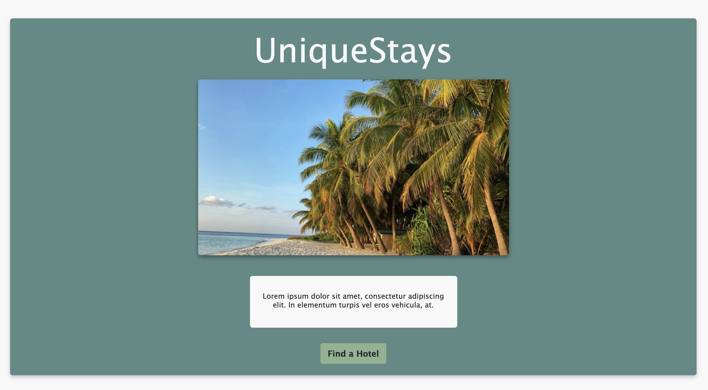
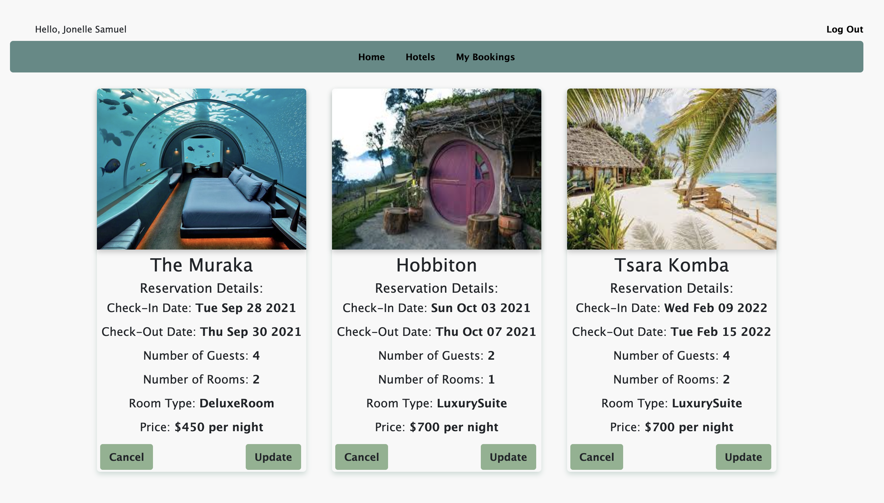

# UniqueStays

UniqueStays is an app for booking reservations at unique hotels around the world.
On the apps main page there is a variety of hotels to choose from. The user has the option to login with google at the top of the page or when the book a room button is selected they are rerouted to the google authentication page.
The user can select the book a room button to create a reservation at any of the listed hotels.
The reservation page will load with a form to select a check-in and check-out date as well as the number of guests, number of rooms and room type. The price is fixed based on the selected room type.
The booking is saved when the book reservation button is clicked. The next page that will load is the details page.
The details page will display the information for all the hotels the user has booked. There is an update button and cancel button for each reservation.
The update button allows the user to change any of the details for the selected reservation. The cancel button will cancel the select reservation.
The user has the option to logout of the app on the hotel page or any of the reservations page.

## Screenshots

## Tech Stack

Node, Express, Mongoose, MongoDB, HTML 5, CSS 3, JavaScript ES6

## Deployment

https://unique-stays.herokuapp.com/y

## Next Steps

A details page for each hotel where reviews can be made.
The details page will display al the reviews.
